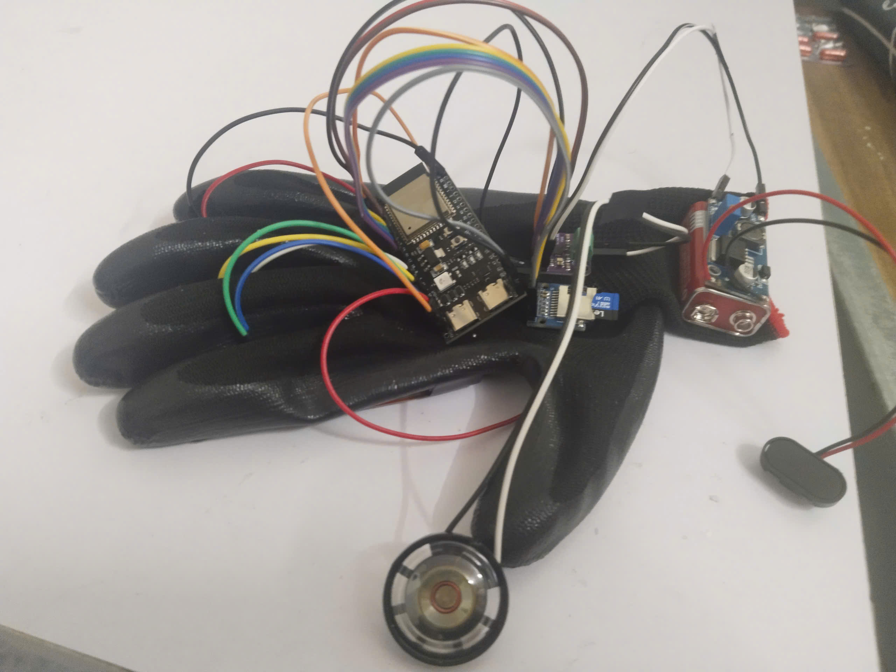
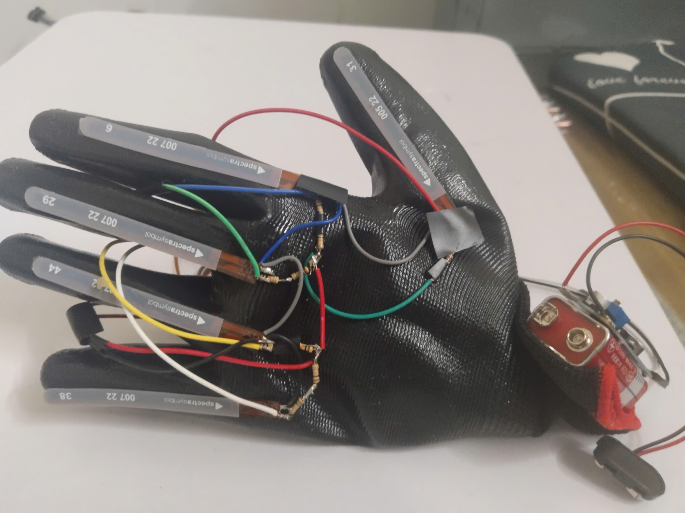
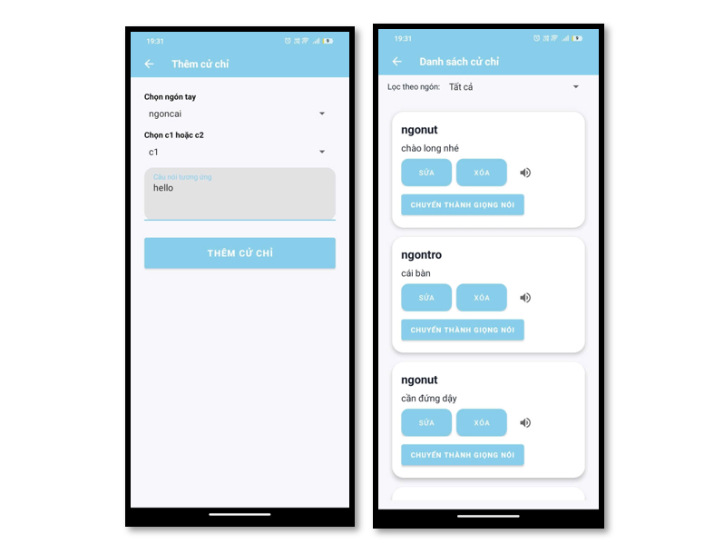
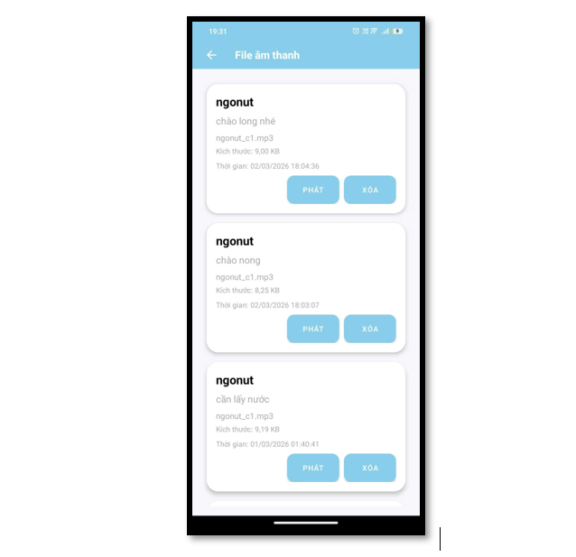

# 🧤 SmartGloves

A smart glove system designed to assist people with hearing or speech impairments by recognizing hand gestures through Flex Sensor voltage analysis and converting them into speech in real time. The system integrates ESP32-S3, an Android application, Firebase, IoT communication, and a Node.js Text-to-Speech (TTS) server.

---

## 📖 Project Overview

SmartGloves is an IoT-based communication system that translates sign language gestures into spoken language.

The system uses Flex Sensors attached to each finger to measure bending angles. ESP32-S3 collects sensor voltage values, recognizes predefined gestures, and sends the recognition result to an Android application via Firebase. The Android application communicates with a Node.js Text-to-Speech server to generate speech, helping users communicate more naturally.

---

## ✨ Features

- ✋ Real-time hand gesture recognition
- 📈 Voltage-based gesture classification
- 📡 ESP32-S3 IoT communication
- ☁️ Firebase Realtime Database integration
- 📱 Android application
- 🔊 Text-to-Speech (TTS) voice generation
- 📝 Gesture history
- ⚡ Fast response time

---

## 🛠 Technologies

### Hardware

- ESP32-S3
- Flex Sensors
- Speaker
- Battery / USB Power

### Software

- Arduino IDE
- Android Studio
- Visual Studio Code
- Node.js
- Firebase Realtime Database
- Java
- C++
- JavaScript

---

## 📂 Project Structure

```text
SmartGloves
│
├── Firmware/              # ESP32-S3 source code
├── AndroidApp/            # Android application
├── Server/                # Node.js TTS server
├── Images/                # Project images
├── README.md
└── .gitignore
```

---

## ⚙️ Installation

### 1. ESP32 Firmware

- Open the `Firmware` folder using Arduino IDE.
- Install all required libraries.
- Select your ESP32-S3 development board.
- Configure Wi-Fi credentials.
- Upload the firmware.

---

### 2. Android Application

Open the Android project using Android Studio.

Add your Firebase configuration file:

```text
app/google-services.json
```

Sync Gradle and build the application.

Install the APK on your Android phone.

---

### 3. Node.js TTS Server

Open Terminal inside the Server folder.

Install dependencies:

```bash
npm install
```

Start the server:

```bash
npm start
```

---

## 🚀 System Workflow

1. User performs a hand gesture.
2. Flex Sensors measure finger bending.
3. ESP32-S3 reads sensor voltage values.
4. The gesture is recognized.
5. Recognition result is uploaded to Firebase.
6. Android application receives the result.
7. Android sends the text to the TTS server.
8. The TTS server generates speech.
9. Audio is played to the user.

---

# 📸 Demo

## 🧤 Hardware

<p align="center">
  
  
</p>

---

## 📱 Android Application

<p align="center">
  
  
</p>

---


```text
Flex Sensors
      │
      ▼
 ESP32-S3
      │
      ▼
 Firebase
      │
      ▼
 Android Application
      │
      ▼
 Node.js TTS Server
      │
      ▼
 Speaker
```

---

## 🔧 Requirements

### Hardware

- ESP32-S3
- 5 × Flex Sensors
- Speaker
- USB Cable

### Software

- Arduino IDE
- Android Studio
- Node.js
- Visual Studio Code

---

## 👨‍💻 Author

**Lam Vica**

Graduation Project

Hanoi University of Natural Resources and Environment

---

## 📄 License

This project is developed for educational and research purposes only.